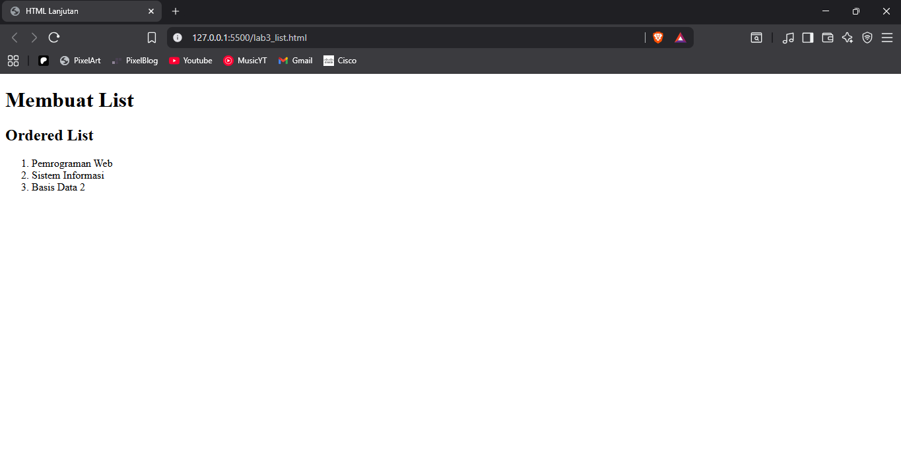
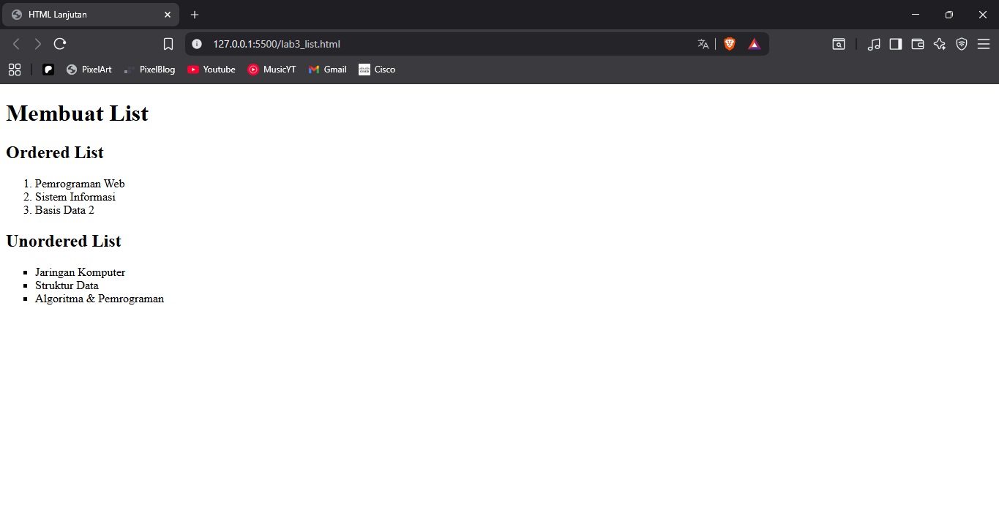
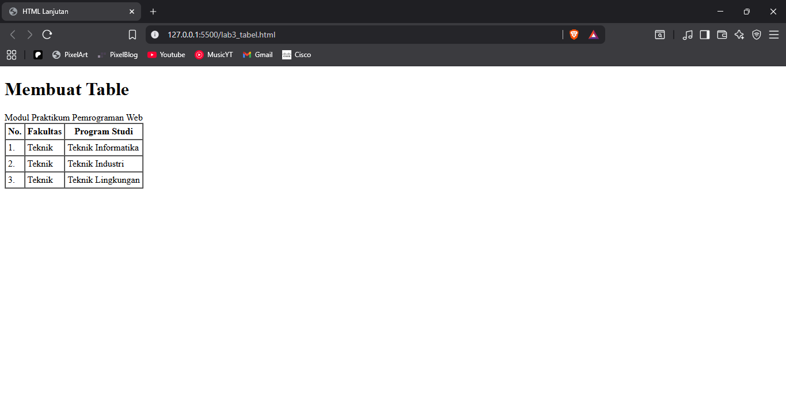
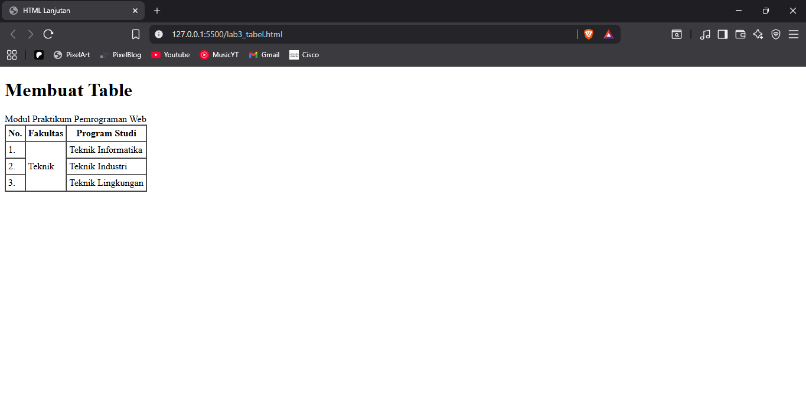
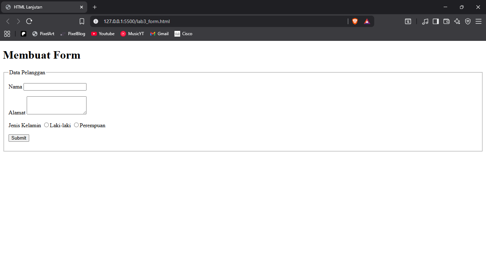
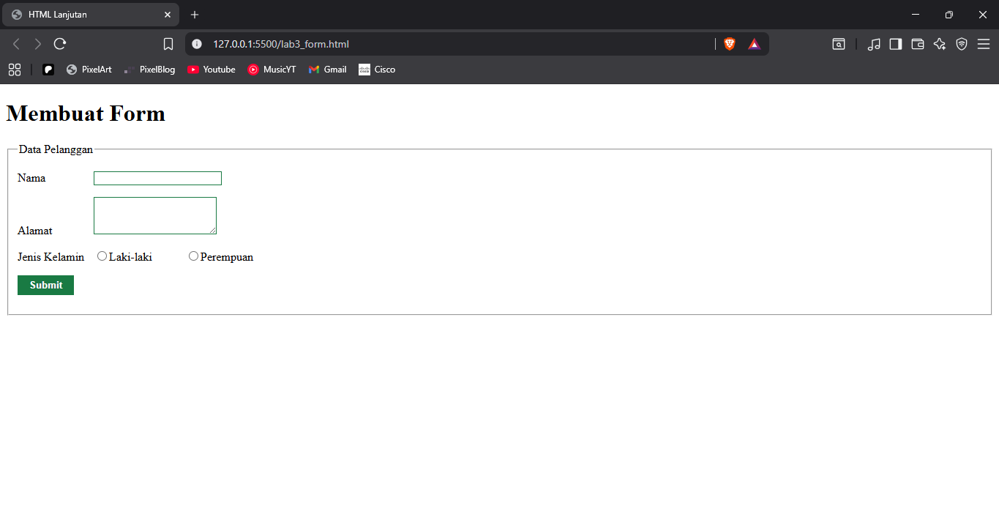

# Laporan Praktikum Lab3Web

# Membuat List
List digunakan untuk menampilkan kumpulan item secara terstruktur di halaman web.
HTML menyediakan tiga jenis list utama: unordered, ordered, dan description list.  

### Ordered List
Digunakan untuk menampilkan daftar berurutan (angka atau huruf), menggunakan tag `<li>` untuk setiap item

### Unordered List
Ordered list digunakan untuk menampilkan daftar tanpa urutan (bullet points), setiap item ditulis dengan tag `<li>`

### Description List
Digunakan untuk menampilkan daftar berisi istilah dan deskripsi.  
Menggunakan :  
- `<dt>` Untuk term (judul/istilah)
- `<dd>` Untuk description (penjelasan)

# Membuat Table

### Membuat Rowspan

# Membuat Form

### Menambahkan CSS pada Table

# Tugas

